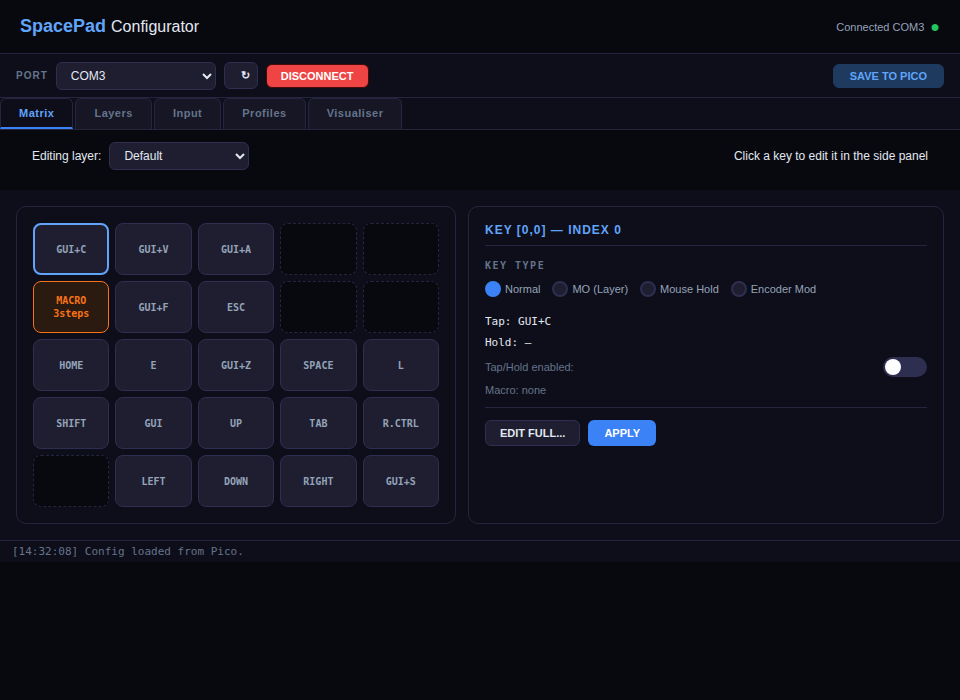
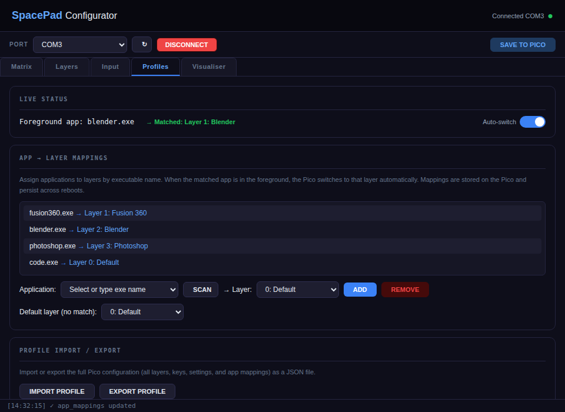

# SpacePad

**A 20-key macropad (non-standard 5×5 matrix) with an integrated 3D space mouse, dual rotary encoders, analog joystick, and OLED display — powered by a Raspberry Pi Pico and CircuitPython.**

SpacePad is a fully open-source input device designed for creative professionals, CAD users, and anyone who wants deep keyboard/mouse customization. It combines a 20-key matrix, a CJMCU-90393 (MLX90393) magnetometer-based space mouse for 3D orbit/pan/zoom driven by a custom-built I²C driver, two clickable rotary encoders, an analog joystick for mouse control, and a 128×32 OLED status display — all configurable through a single desktop app that doubles as a system tray auto-layer switcher.

> **This project is a fork of [jeevan8232/macrokeyboard](https://github.com/jeevan8232/macrokeyboard)** — the original hardware design, 3D printable files, and keycap STLs are from that project. SpacePad builds on top of it with a fully rewritten firmware, a desktop configurator GUI with integrated tray app, OLED support, and a custom magnetometer driver.

**3D print files:** https://www.thingiverse.com/thing:7293580

**Demo video:** https://www.youtube.com/watch?v=AjmmTDKetks

---

## Quick Start

1. **Flash CircuitPython 9+** onto the Pico (hold BOOTSEL, drag the `.uf2` file)
2. **Copy `boot.py`, `code.py`, and `font5x8.bin`** to the CIRCUITPY drive, plus the `lib/` folder
3. **Install the GUI:** `pip install PySide6 pyserial psutil`
4. **Run:** `python spacepad_gui.py` — select the COM port, click Connect
5. **Configure:** click keys to remap, add layers from built-in templates (Fusion 360, Onshape, Blender, etc.), set up app-to-layer auto-switching in the Profiles tab

Full build and wiring guide: [`spacepad_setup_guide.pdf`](spacepad_setup_guide.pdf)

---

## Screenshots

**Matrix tab** — click any key to edit in the side panel. Ghost positions are dimmed. Full editor dialog available via "EDIT FULL..."



**Profiles tab** — scan running apps, assign to layers, live foreground display. Mappings stored on Pico.



---

## Features

### Hardware
- **20-key matrix** (non-standard layout on a 5×5 matrix with 5 ghost positions) with diode isolation, supporting per-key tap, hold, tap/hold combos, macros, momentary layers, mouse button hold, and encoder speed modifiers
- **CJMCU-90393 magnetometer** (MLX90393) acting as a contactless 3D space mouse — orbit, pan, and zoom in CAD software by tilting a magnet above the sensor. Driven by a custom-built non-blocking I²C driver (no external library required). **Important:** solder the CS and PU jumper pads on the back of the CJMCU board to enable I²C mode and pull-ups
- **Dual rotary encoders** with push-button switches, configurable per-layer for horizontal scroll, vertical scroll, zoom, undo/redo, tab switching, or volume control
- **Analog joystick** with push-button click for full mouse cursor control with adjustable speed, deadzone, and axis inversion
- **SSD1306 128×32 OLED** displaying the active layer name, encoder modes, and flash notifications
- **Two extra buttons** — one for layer cycling, one configurable (default: F6)
- **Raspberry Pi Pico** running CircuitPython — no compiling, just drag-and-drop firmware

### Firmware (`circuitpython/code.py`)
- Full HID support: keyboard, mouse, and consumer control (media keys)
- Unlimited layers with momentary (MO) layer switching via a key stack
- Per-key configuration: tap action, hold action, tap/hold toggle, multi-step macros with delays, key repeat, mouse button hold, and encoder speed modification
- Non-blocking MLX90393 state machine with a custom-built I²C driver — no external magnetometer library needed; uses raw I²C commands with pre-allocated buffers so the main loop never sleeps waiting for sensor data
- Space mouse with configurable sensitivity, deadzone, Z-threshold, low-pass filter, acceleration curve, orbit enter/exit timing, and Z-axis mode (zoom or pan). **Orbit and pan key combos are configurable per-layer** — supports Fusion 360 (Shift+MMB), Onshape/SolidWorks (MMB), Blender (MMB), Maya (Alt+MMB), and custom combos
- Joystick with boot-time auto-calibration, fractional sub-pixel accumulators for smooth movement, configurable deadzone/speed/inversion
- Encoder 2 zoom override: hold the extra button to temporarily switch encoder 2 to zoom mode
- CRC32-checksummed settings persistence to on-board flash (`settings.json`)
- JSON serial protocol for full bidirectional communication with the GUI
- Telemetry streaming at 20 Hz for live joystick and space mouse visualization
- Passthrough mode for the GUI visualizer (reports key events without sending HID)
- App-to-layer mappings stored on Pico alongside all other settings
- Performance-optimized hot path: flat settings cache, pre-allocated I²C buffers, pre-built JSON strings, dispatch tables instead of elif chains

### Desktop App (`spacepad_gui.py`)

A single application that serves as both the full configurator GUI and a background auto-layer switcher — no separate tray app needed.

**Configuration tabs (5 streamlined tabs, down from 7):**
- **Matrix** — visual key grid with a side panel editor. Click any key to edit its tap/hold/macro/type inline; click "EDIT FULL..." for the complete key editor dialog with keystroke capture. Ghost positions (5 unused matrix slots) are visually dimmed and disabled
- **Layers** — add, remove, rename layers; toggle space mouse per layer; **orbit/pan key combo presets per-layer** (Fusion 360, Onshape, Blender, etc.); encoder modes, switch actions, speed, and invert are configured here per-layer alongside the layer they belong to; plus tap/hold threshold, key repeat, and extra button settings. New layers can be created from **app templates** or by **copying an existing layer**
- **Input** — joystick (speed, deadzone, axis inversion, click action) and space mouse (sensitivity, deadzone, Z-threshold, filter, acceleration curve, orbit hysteresis, Z-mode, zero calibration) in one place
- **Profiles** — app-to-layer mapping with live process scanner, default fallback layer, real-time foreground app display, auto-switch toggle, and profile import/export
- **Visualizer** — real-time key press heatmap, joystick XY plot, space mouse XYZ bar meters, orbit/pan state indicators, and boot health readout

**Integrated tray features:**
- Closing the window minimizes to system tray instead of quitting
- Automatically switches Pico layers based on the foreground application's executable name (detected via `psutil`, not fragile window title matching)
- Process scanner in the Profiles tab — click SCAN to see running apps, pick one, assign a layer
- Default fallback layer when no app mapping matches
- Live status display showing the current foreground app and matched layer
- Tray icon tooltip shows current layer and matched app at a glance
- Tray right-click menu: open GUI, current layer/app info, toggle auto-switching, launch minimized option, quit
- Auto-connect to the last known COM port on startup
- Unsaved changes warning before quitting
- Launch with `--minimized` flag or enable "Launch minimized to tray" in the tray menu to start straight to tray

---

## Pin Mapping

| Function | GPIO | Notes |
|---|---|---|
| Key matrix rows | GP0 – GP4 | 5 rows |
| Key matrix columns | GP5 – GP9 | 5 columns (active low, `columns_to_anodes=False`) |
| Encoder 1 (CLK, DT, SW) | GP10, GP11, GP12 | |
| Encoder 2 (CLK, DT, SW) | GP13, GP14, GP15 | |
| I²C SDA (MLX + OLED) | GP16 | Shared bus, CJMCU-90393 @ 0x0C, OLED @ 0x3C |
| I²C SCL (MLX + OLED) | GP17 | Shared bus, 100 kHz |
| Extra button 1 | GP18 | Configurable action / enc2 zoom hold |
| Extra button 2 | GP19 | Layer cycle |
| Joystick click | GP22 | Configurable action |
| Joystick Y axis | GP26 | ADC |
| Joystick X axis | GP27 | ADC |

A detailed wiring diagram for the key matrix is included in the [setup guide PDF](spacepad_setup_guide.pdf).

---

## Installation

### Prerequisites
- **Raspberry Pi Pico** with [CircuitPython](https://circuitpython.org/board/raspberry_pi_pico/) installed (9.x recommended)
- **CircuitPython libraries** on the Pico's `CIRCUITPY/lib/` folder:
  - `adafruit_hid` (keyboard, mouse, consumer control)
  - `adafruit_ssd1306` (OLED driver)
  - `adafruit_bus_device` (I²C helpers for OLED)
  - No magnetometer library needed — the firmware includes a custom-built I²C driver for the CJMCU-90393
- **Python 3.10+** on your PC for the configurator app

### Pico Firmware Setup

1. Install CircuitPython on your Pico (hold BOOTSEL, drag the `.uf2` file).
2. Copy the required Adafruit libraries to `CIRCUITPY/lib/` (reference copies are in `circuitpython/lib/`).
3. Copy `circuitpython/boot.py` to the root of `CIRCUITPY` — this remounts the filesystem as writable so the firmware can save settings.
4. Copy `circuitpython/code.py` to the root of `CIRCUITPY` — the firmware starts automatically.

### Desktop App

Install dependencies and run:

```bash
pip install -r requirements.txt
python spacepad_gui.py
```

Or install manually:

```bash
pip install PySide6 pyserial psutil
python spacepad_gui.py
```

To start minimized to the system tray:

```bash
python spacepad_gui.py --minimized
```

### Building a Standalone Executable (Windows)

Run the included build script to create a portable `.exe`:

```bash
build.bat
```

This produces `SpacePad Configurator.exe` in the `dist/` folder — a single executable that handles both configuration and background auto-layer switching.

---

## Usage

### Connecting
1. Plug the Pico in via USB.
2. Open SpacePad Configurator. It auto-connects to the last known port, or select one manually and click **Connect**.
3. The GUI fetches the current configuration from the Pico automatically.

### Configuring Keys
- Go to the **Matrix** tab and double-click any key in the matrix grid.
- In the key editor dialog, set the tap action (e.g., `GUI + C` for copy), hold action, enable tap/hold behavior, assign a macro, or change the key type to momentary layer, mouse hold, or encoder modifier.
- Changes are sent to the Pico immediately over serial. Click **Save to Pico** in the toolbar to persist to flash.

### Layers
- Add layers in the **Layers** tab. Each layer has its own key bindings, encoder modes, encoder switch actions, and a toggle for enabling the space mouse.
- Switch layers on the pad by pressing the layer cycle button (GP19), or use a key configured as momentary (MO) to temporarily activate a layer while held.

### Space Mouse
- The CJMCU-90393 (MLX90393) sensor detects magnetic field changes when you tilt or move a magnet above it.
- When the XY displacement exceeds the deadzone for longer than the orbit-enter time, the firmware holds the configured orbit modifier keys + Middle Mouse Button to orbit in CAD applications. The orbit/pan key combos are set per-layer, with built-in templates for Fusion 360, Onshape, SolidWorks, Blender, Maya, and FreeCAD.
- The Z axis can be configured for scroll-wheel zoom or middle-button vertical pan.
- Enable the space mouse per-layer in the Layers tab — it only activates on layers where you need it.

### Auto Layer Switching
1. Go to the **Profiles** tab.
2. Click **SCAN** to see a list of currently running applications.
3. Select an app (e.g., `blender.exe`), choose a layer, and click **ADD**.
4. Set a **default layer** for when no mapping matches.
5. Click **Save to Pico** — mappings are stored on the Pico alongside all other settings.
6. Close the window — the app minimizes to the system tray and continues switching layers automatically based on the foreground application.

The live status area in the Profiles tab shows the current foreground app and which layer it matched, so you can verify your mappings are working in real time.

---

## Serial Protocol

The Pico and GUI communicate over USB serial at 115200 baud using newline-delimited JSON messages.

### Commands (PC → Pico)

| Action | Description |
|---|---|
| `get_config` | Request the full configuration |
| `subscribe` / `unsubscribe` | Start/stop telemetry streaming |
| `passthrough_on` / `passthrough_off` | Enable/disable HID passthrough (visualizer mode) |
| `set` | Set a global config key (`key`, `value`) |
| `set_layers` | Replace all layers |
| `add_layer` / `remove_layer` / `rename_layer` | Layer management |
| `set_active_layer` | Switch to a specific layer by index |
| `set_key` | Configure a single key (`layer`, `index`, plus key fields) |
| `set_layer_prop` | Set a layer-level property (e.g., `sm_active`, encoder modes) |
| `set_encoder_mode` | Set encoder mode for a layer |
| `set_enc_sw` | Set encoder switch action for a layer |
| `zero` | Recalibrate the space mouse sensor |
| `save` | Write current config to flash |
| `ping` | Health check (responds with `pong`) |

### Events (Pico → PC)

| Event | Description |
|---|---|
| `boot_complete` | Startup health report (MLX, OLED, settings status, layer count) |
| `config` | Full configuration payload |
| `layer_changed` | Active layer index, name, MO status, space mouse active |
| `key_press` / `key_release` | Key index for visualizer |
| `joy_data` | Joystick X/Y values (20 Hz) |
| `sm_data` | Space mouse filtered X/Y/Z values (20 Hz) |
| `saved` / `save_failed` | Flash write result |
| `joy_calibrated` | Joystick center values at boot |

---

## File Structure

```
SpacePad/
├── circuitpython/
│   ├── boot.py              # CircuitPython boot — remounts filesystem writable
│   ├── code.py              # Pico firmware (copy to CIRCUITPY root)
│   ├── font5x8.bin          # OLED font file (copy to CIRCUITPY root)
│   └── lib/                 # Adafruit CircuitPython libraries
├── 3d files/
│   ├── stl/                 # 3D printable parts (keycaps, case, spacemouse)
│   └── step/                # STEP assembly file
├── fusion360/               # Fusion 360 source project
├── spacepad_gui.py          # Desktop app — configurator + system tray
├── build.bat                # PyInstaller build script for Windows .exe
├── requirements.txt         # Python dependencies
├── spacepad_setup_guide.pdf # Hardware assembly, setup guide, and wiring diagram
├── screenshots/             # GUI screenshots for README
└── LICENSE                  # GNU GPL v3
```

---

## Hardware BOM

| Component | Quantity | Notes |
|---|---|---|
| Raspberry Pi Pico | 1 | Any Pico with USB and CircuitPython support |
| Mechanical key switches | 20 | MX-compatible or equivalent |
| Signal diodes (1N4148) | 20 | One per key for matrix isolation |
| Rotary encoders with switch | 2 | Standard incremental with push button |
| Analog joystick module | 1 | PS2-style dual-axis with click (e.g., KY-023) |
| CJMCU-90393 magnetometer | 1 | MLX90393-based breakout, I²C address 0x0C, custom driver (no library needed). **Solder the CS and PU jumpers on the back of the board** to enable I²C mode and pull-ups |
| Neodymium magnet | 1 | Mounted above the CJMCU-90393 on a lever/spring |
| SSD1306 OLED 128×32 | 1 | I²C, address 0x3C |
| Tactile buttons | 2 | For extra button 1 (GP18) and layer cycle (GP19) |

For 3D printable parts, see the [`3d files/stl/`](3d%20files/stl/) directory or the [Thingiverse page](https://www.thingiverse.com/thing:7293580).

---

## Credits

This project is forked from [jeevan8232/macrokeyboard](https://github.com/jeevan8232/macrokeyboard) — the original hardware design, 3D printable enclosure, keycap STLs, and Fusion 360 assembly files.

---

## License

This project is licensed under the [GNU General Public License v3.0](LICENSE).
